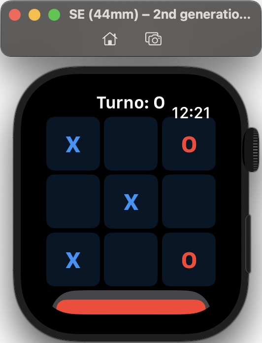
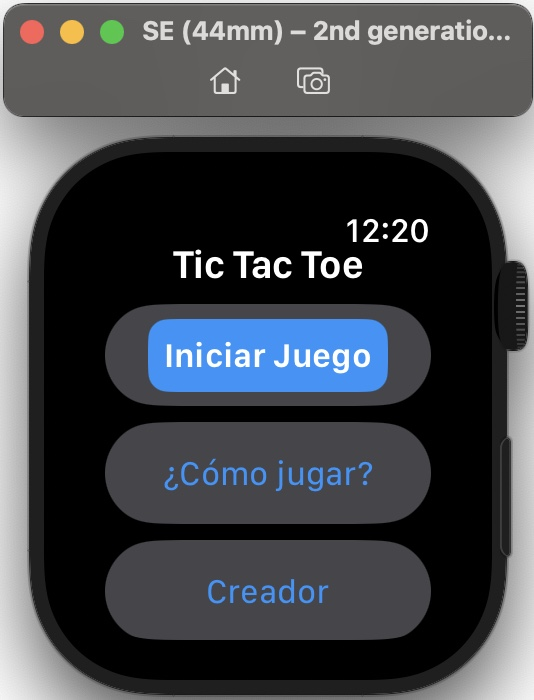
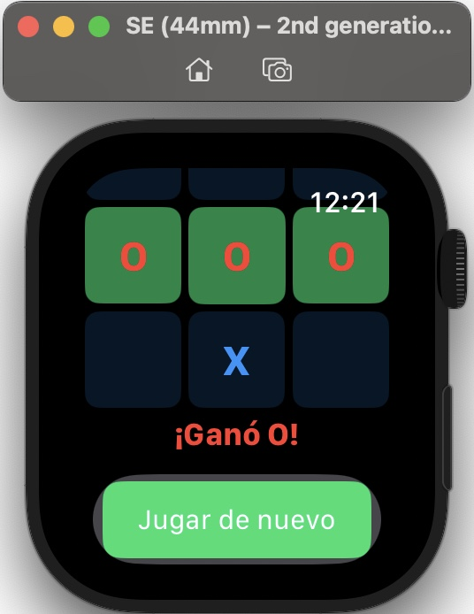

# 🎮 AppleWatch-TicTacToe

[](https://swift.org/)
[](https://www.apple.com/watchos/)
[](LICENSE)

<p align="center">
  
</p>


## 📱 Descripción

**AppleWatch-TicTacToe** es un juego clásico de Tic Tac Toe (Tres en raya) diseñado específicamente para Apple Watch. La aplicación cuenta con una interfaz optimizada para pantallas pequeñas y controles táctiles precisos.

## ✨ Características

- 🎲 Juego clásico de Tic Tac Toe para dos jugadores
- ⌚ Diseñado específicamente para Apple Watch
- 🎯 Interfaz minimalista y fácil de usar
- 🔄 Sistema de turnos alternados entre X y O
- 🏆 Detección automática de ganador
- 🎨 Resaltado visual de la combinación ganadora
- 🌐 Disponible en español

## 🛠️ Tecnologías utilizadas

- SwiftUI
- WatchKit
- watchOS

## 📋 Requisitos

- watchOS 10.0+
- Xcode 15.0+
- Swift 5.9+

## 🚀 Instalación

1. Clona este repositorio:
```bash
git clone https://github.com/TuUsuario/AppleWatch-TicTacToe.git
```

2. Abre `TicTacToe.xcodeproj` en Xcode

3. Selecciona tu dispositivo Apple Watch o simulador como destino

4. Ejecuta la aplicación (⌘+R)

## 🎮 Cómo jugar

1. Abre la aplicación en tu Apple Watch
2. Toca "Iniciar Juego" en el menú principal
3. Los jugadores se turnan para colocar su símbolo (X u O) en la cuadrícula
4. El primer jugador en alinear tres símbolos iguales (horizontal, vertical o diagonal) gana
5. Si la cuadrícula se llena sin un ganador, el juego termina en empate

## 📸 Capturas de pantalla

<p align="center">
  
  
  
</p>

## 👨‍💻 Autor

Michell Alexis Policarpio Moran - Ingeniero Informático de Veracruz, México

## 📄 Licencia

Este proyecto está licenciado bajo la Licencia MIT - ver el archivo [LICENSE](LICENSE) para más detalles.
