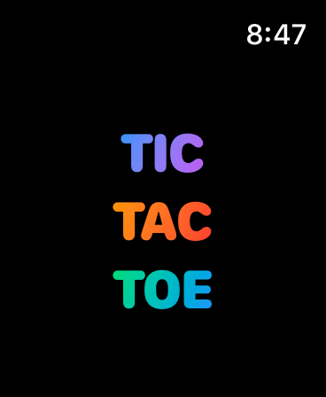
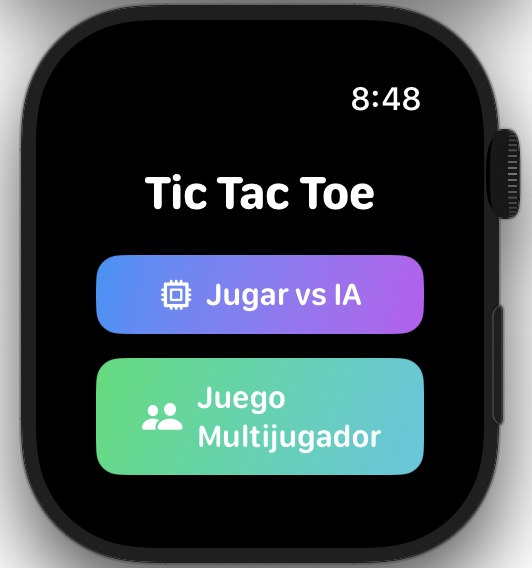
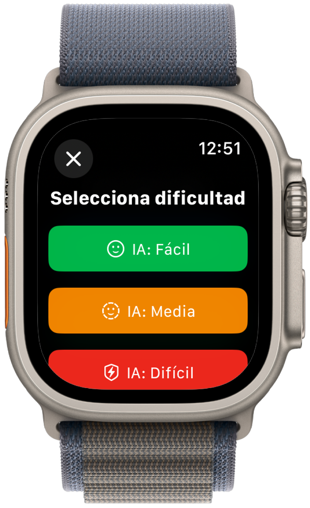
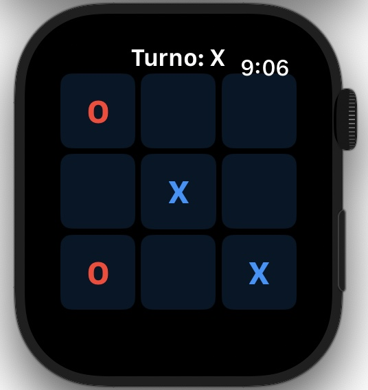
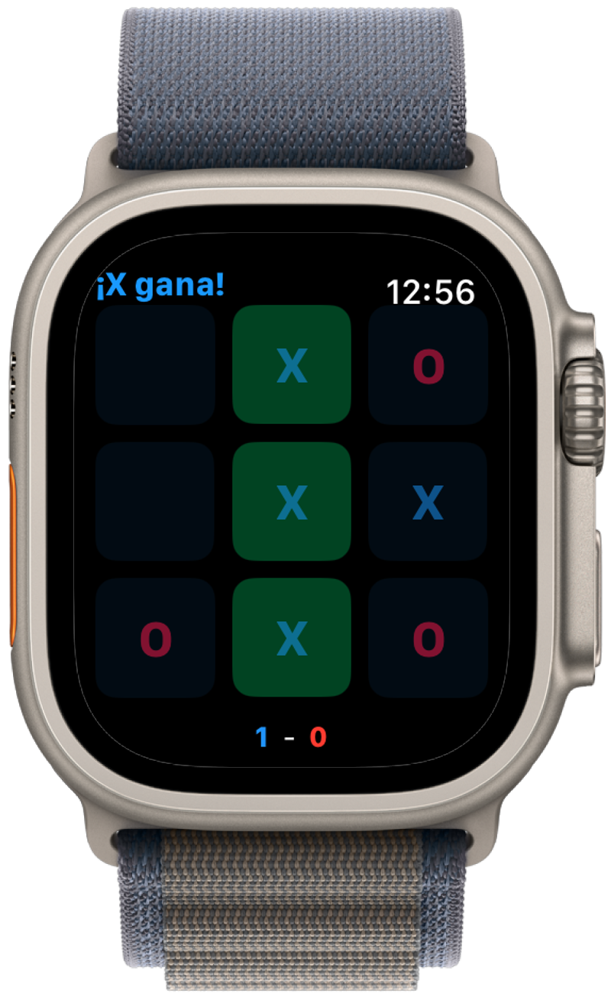
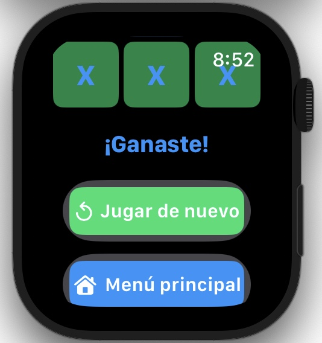

# 🎮 AppleWatch-TicTacToe

[](https://swift.org/)
[](https://www.apple.com/watchos/)
[](LICENSE)

<p align="center">
  
</p>

## 📱 Descripción

**AppleWatch-TicTacToe** es un juego clásico de Tic Tac Toe (Tres en raya) diseñado específicamente para Apple Watch. La aplicación cuenta con una interfaz optimizada para pantallas pequeñas y controles táctiles precisos, ofreciendo diferentes modos de juego y niveles de dificultad.

## ✨ Características

- 🎮 Juego contra la computadora con tres niveles de desafío
- 👥 Modo multijugador para jugar con un amigo
- 🎲 Experiencia clásica de Tic Tac Toe con interfaz intuitiva
- ⌚ Diseño optimizado para Apple Watch
- 🎯 Interfaz minimalista y fácil de usar
- 🔄 Sistema de turnos alternados entre X y O
- 🏆 Detección automática de victoria
- 🎨 Resaltado visual de la combinación ganadora
- 🌈 Interfaz con gradientes y animaciones atractivas
- 🌐 Disponible en español

## 🛠️ Tecnologías utilizadas

SwiftUI, WatchKit, watchOS, Combine

## 📋 Dispositivos compatibles

El juego es compatible con:
- Apple Watch Series 4, 5, 6, 7, 8, 9 y 10
- Apple Watch SE (1ª y 2ª generación)
- Apple Watch Ultra
- watchOS 10.0 o superior

## 🚀 Instalación

Clona este repositorio, abre `TicTacToe.xcodeproj` en Xcode 15.0+, selecciona tu Apple Watch o simulador como destino y ejecuta la aplicación con ⌘+R.

## 🎮 Cómo jugar

Abre la aplicación en tu Apple Watch y elige el modo de juego. Los jugadores se turnan para colocar su símbolo (X u O) en la cuadrícula. Gana el primero en alinear tres símbolos iguales horizontal, vertical o diagonalmente. Si la cuadrícula se llena sin un ganador, el juego termina en empate.

## 🎯 Niveles de desafío

El juego ofrece tres niveles de desafío cuando juegas contra la computadora:

- **Principiante**: La computadora realiza movimientos aleatorios
- **Intermedio**: Combina estrategia básica con algunos movimientos aleatorios
- **Avanzado**: Utiliza estrategia completa, analizando el tablero para realizar los mejores movimientos

## 📸 Capturas de pantalla

<p align="center">
  
  
</p>
<p align="center">
  
  
  
</p>

## 🔍 Estructura del proyecto (MVVM)

```
├── Models/
│   ├── GameMode.swift
│   ├── Game.swift
│   ├── Player.swift
│   ├── Board.swift
│   └── GameBoard.swift
│
├── Views/
│   ├── MenuView.swift
│   ├── GameView.swift
│   ├── IntroView.swift
│   └── Components/
│       ├── GameResultView.swift
│       └── GameBoardView.swift
│
├── ViewModels/
│   ├── MenuViewModel.swift
│   ├── GameViewModel.swift
│   └── AIPlayerViewModel.swift
│
├── Utilities/
│   └── HapticManager.swift
│
├── Assets.xcassets/
├── .vscode/
├── ContentView.swift
└── TicTacToeApp.swift
```

## 👨‍💻 Autor

Michell Alexis Policarpio Moran - Ingeniero Informático de Veracruz, México

## 📄 Licencia

Este proyecto está licenciado bajo la Licencia MIT - ver el archivo [LICENSE](LICENSE) para más detalles.
